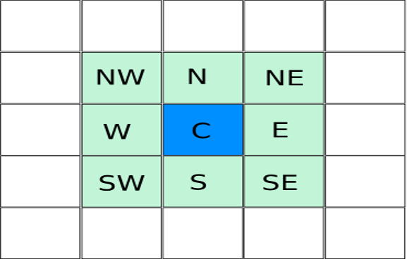

# Game Of Life

Bienvenue sur ce TP d'introduction à Kotlin dans lequel vous allez devoir implément le célèbre jeu de la vie !

Tout d'abord veuillez suivre le tutoriel d'installation pour avoir un environnement de travail bien configuré : 
[GUIDE D'INSTALLATION](TOOLS.md)


## Introduction au jeu de la vie
Avant de démarrer le TP il est indispensable d'expliquer le fonctionnement du jeu de la vie sans quoi vous n'iriez pas loin !
Vous inquiétez pas il n'y a rien de compliqué :snowman: 

Le jeu de la vie est un automate cellulaire imaginé par le célèbre mathématicien John CONWAY dans les années 70.

Le principe du "jeu" est très simple, il s'agit de suivre l'évolution de _cellules_ représentées par les cases 
d'une grille à deux dimensions théoriquement infinie 
( mais dans notre cas elle sera finie et carrée pour simplifier )
en fonction de règles simplistes qui définissent l'état d'une cellule : **_vivantes_** ou **_mortes_**
(Et oui désolé de vous l'apprendre le jeu de la vie n'est pas réellement un jeu :yum: )

À chaque étape (_tour de jeu_), l’évolution d’une cellule est entièrement déterminée 
par l’état de ses huit voisines de la façon suivante :

- Une cellule morte possédant exactement trois voisines vivantes devient vivante (elle naît).
- Une cellule vivante possédant deux ou trois voisines vivantes le reste, sinon elle meurt.


:heavy_exclamation_mark: Point culture, malgré des règles très simples, le jeu de la vie est Turing-complet.

Pour les plus curieux voici une vidéo qui décrit le phénomène complexe 
qu'illustre le jeu de la vie d'un point de vue scientifique: https://www.youtube.com/watch?v=S-W0NX97DB0 
(à regarder seulement si vous avez fini le TP :sunglasses: )

:link: Voici d'autres liens qui pourraient vous être utile : 
- https://fr.wikipedia.org/wiki/Jeu_de_la_vie
- https://fr.wikipedia.org/wiki/Structure_stable_(automate_cellulaire)
- https://fr.wikipedia.org/wiki/Oscillateur_(automate_cellulaire)

Et aussi les exemples du _live coding_ que vous trouverez ici :

- https://github.com/nowaiiNN/JavaToKotlin

Vous pouvez également utiliser cette [page](https://fabiomsr.github.io/from-java-to-kotlin/) 
afin de facilement retrouver les principaux éléments de la syntaxe Kotlin.

## Préparation 

Temps estimé : 1h30 :clock230: 

L'objectif de ce TP est très simple, il suffit de compléter tous les TODO() 
qui se situent dans le package **_game_** et également dans les tests. 
Si vous utilisez un vrai IDE (sous entendu intelliJ :trollface:) vous avez même un superbe onglet qui liste les TODO 
dans votre code ! Vous devriez voir 19 occurences de TODO.

### Quelques bons conseils

Etant donné que vous êtes de bons développeurs vous pouvez réaliser ce TP en TDD (Test Driven Development).

Nous vous avons préparé une vingtaine de tests 
(en vous en laissant certains à développer faut pas rêver non plus :smiling_imp: ) 
Libre à vous de rajouter des tests qui vous semblent nécessaires et pertinents !

Nous vous conseillons donc plus que fortement de commencer par les tests qui vous guideront pour implémenter
la logique de la classe Board.
Cependant vous pouvez implémenter les tests au fil de l'eau voir même à la toute fin pour valider votre code. 
L'important c'est que ce soit vert !

Vu que nous sommes développeurs super sympas, nous vous avons épargné le développement d'une GUI en swing :zzz: 
Vous n'avez donc pas à toucher aux composants de la vue (dans le package **_view_**)

De manière plus générale vous n'avez pas à toucher au code déjà écrit ! 


### Quelques explications sur le code

Avant de foncer tête baissée dans le code nous allons vous expliquer quelques choix d'implémentations 
que nous avons fait et que nous vous imposons :smiling_imp:
___


#### Le plateau

Nous avons représenté le plateau sous la forme d'une liste de cellules vivantes car c'est la manière la plus
optimale de faire. Naturellement on serait tenté d'utiliser un tableau à 2 dimensions que l'on parcourerait 
en regardant si la cellule est vivante ou morte. 

Désolé mais c'est ce qu'on appelle de la naïveté :chicken: 

Pourquoi aurions-nous besoin de stocker les cellules mortes si la seule information qu'elles ont
a nous apporter est le fait qu'elles soient ... mortes ? 
C'est pourquoi stocker uniquement les cellules vivantes dans une liste nous permet de déduire le fait 
que toute cellule qui n'est pas dans cette liste est forcément morte !

Avouez qu'il est plus facile d'utiliser la méthode ``contains`` d'une liste plutôt que de parcourir 
tout un tableau à deux dimensions et vérifier l'état de chaque cellule :neckbeard:


Ainsi le plateau de jeu sera du type : 

```
var livingCells: MutableList<Cell>
```

 :warning: _Nous déclarons la liste avec **var** car il faudra réaffecter son contenu à chaque 
 passage dans la méthode **evolve()**_

#### Les cellules

Pour représenter une cellule nous avons fait le choix d'utiliser 
l'objet ``Pair``. En effet une cellule n'a besoin de connaître que ses coordonnées (qui ne sont que des _int_)
et l'objet ``Pair`` constitue la structure de donnée la plus pertinente pour représenter cela.

Ainsi une cellule sera du type : 

```
Pair<Int,Int>
```

Pour que ce soit plus lisible et clair pour vous nous avons utilisé une fonctionnalité purement syntaxique
de Kotlin qui est le typealias (https://kotlinlang.org/docs/reference/type-aliases.html) qui permet 
simplement de donner un nom alternatif à un type.

Ainsi : 

```
typealias Cell = Pair<Int, Int>
```

Vous permet de manipuler l'objet ``Pair`` ( en accédant aux propriétés ``first`` et ``second`` de l'objet Pair par exemple ) 
de la sorte :

```
Cell.first
Cell.second
```

#### Récupérer la liste des voisins

Pour vous aider à comprendre ce que sont les voisins d'une cellule voici un schéma clair : 



Vous pouvez donc en déduire que pour récupérer la liste des voisins d'une cellule 
il va falloir trouver et soustraire toutes les coordonnées des voisins représentés sur le schéma 
aux coordonnées de la cellule ! 
(Ne nous remercier pas on vient quasiment de faire tout le travail à votre place :ok_hand:)

#### Différences entre deux cellules

Dernier point à propos des cellules, pour pouvoir récupérer les voisins d'une cellule il vous 
faudra faire des opérations sur l'objet ``Pair``. 

Comme indiqué au dans la section précédente, calculer la différence entre deux ``Pair`` risque 
fortement de vous être utile :yum:
Sauf que si vous faites :

```
val a: Pair<Int,Int> = 2 to 1
val b: Pair<Int, Int> = 1 to 1
val c = a - b
```

:exclamation: ``2 to 1`` permet de créer un objet Pair avec comme valeurs : **(2,1)** exactement comme un 
contructeur le ferait.

le compilateur devrait gentillement vous dire de 
changer de métier :see_no_evil: En effet la différence entre des objets n'existe pas par défaut, il nous 
faut donc l'implémenter.

Pour cela nous vous avons présenté une superbe fonctionnalité de Kotlin : les extensions ! 

Ainsi vous trouverez dans la classe Board.kt la ligne suivante : 

```
operator fun Cell.minus(other: Cell): Cell = TODO()
```

Cette extension signifie que nous allons définir la méthode ``minus`` qui n'est autre que l'opérateur ``-``.

En définissant cette implémentation vous pourrez facilement calculer la différence entre deux ``Pair`` 
ou deux ``Cell`` de la sorte : 

```
val a: Cell<Int,Int> = 2 to 1
val b: Cell<Int, Int> = 1 to 1
var c: Cell<Int,Int>
c = a - b
```


## C'est parti !

Je pense qu'on vous a suffisament mis sur la piste ! Mais puisqu'on est super sympa on va tout de même 
vous guider encore un peu :purple_heart:

Nous vous conseillons d'implémenter le code dans cet ordre (en développant les tests et méthodes) :

- init
- isAlive
- Cell.minus
- getNextState
- getNeighbors
- evolve

:exclamation: Pour cette dernière méthode il s'agira de calculer le nombre de voisins en vie 
pour chaque cellule pour ensuite définir l'état de la cellule au prochain tour 
et ainsi mettre à jour la liste des cellules vivantes à la fin de l'itération.

Ces conseils ne sont en rien obligatoires mais ils constituent la manière la plus simple et logique de faire.

___

:checkered_flag: Voilà vous devriez avoir le nécessaire pour développer le jeu de la vie en Kotlin les doigts 
dans le nez :nose:

Si toutefois des points ne vous semblent pas clairs ou si vous avez des questions n'hésitez pas
à vous tourner vers vos supers présentateurs :sunglasses:

___


:white_check_mark: Pour vérifier si vous avez réellement terminé le TP : 

- Tous les tests doivent évidemment passer.
- Vous devriez avoir un plateau qui évolue et au bout de quelques itérations vous devriez apercevoir quelques patterns
comme des structures stables, des oscillateurs ou avec de la chance des vaisseaux et autres structures complexes ;)
N'hésitez pas à jouer avec les paramètres (de temps et de taille) dans la classe MainView.kt et de vérifier 
si vos patterns sont corrects grâce aux liens en haut du fichier.


:warning: Si vous avez vraiment tout terminé super rapidement parce que vous pensez désormais 
être des **boss** de Kotlin, ne partez pas manger ! 
On va vous implémenter en live le code complet du jeu de la vie de la manière dont on l'a pensé ! 

Là on verra qui sont les boss :sunglasses:
___


:beer: :copyright: _This coding dojo is under beerware Licence_ :beer:
