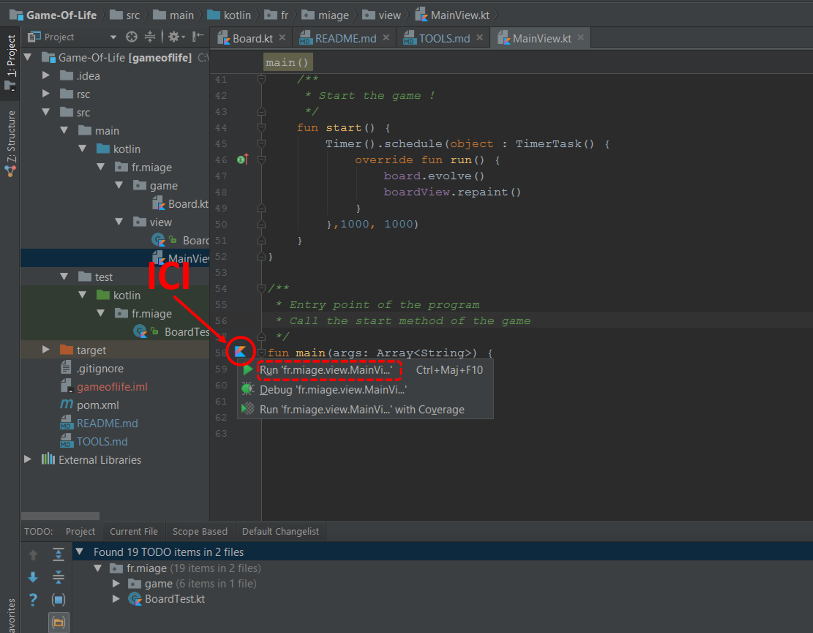

# Tooling 

Nous allons tout d’abord commencer par configurer nos environnements. Afin de faciliter les développement. nous vous conseillons l’utilisation d’IntelliJ qui supporte nativement Kotlin. Néanmoins il est possible d’utiliser Eclipse. 

## IntelliJ

### Installation & configuration  

Pour installer IntelliJ sur les pc de la fac :

1) Téléchargez IntelliJ en tar.gz :

> https://www.jetbrains.com/idea/download/#section=linux

Si vous n'avez pas activé votre licence étudiant et afin de ne pas perdre de temps, nous vous conseillons la version community.

2) Déplacez l'archive dans le répertoire local de votre machine :

```
mv ~/Téléchargements/LE_NOM_DE_L'ARCHIVE /local/VOTRE_NOM/
```

3) Dézippez l'archive :

```
cd /local/VOTRE_NOM/ && tar -zxvf LE_NOM_DE_L'ARCHIVE
```

4) Lancez l'installation :

```
/local/VOTRE_NOM/LE_NOM_DU_DOSSIER/bin/idea.sh
```

Attention : vous n'avez pas le droit de créer l'alias dans le /bin/ il faut donc décocher cette option lors de l’installation.

5) A la fin de l'installation afin de faciliter le lancement vous pouvez créer un alias :

```
alias idea="/local/VOTRE_NOM/LE_NOM_DU_DOSSIER/bin/idea.sh &"
```

6) Une fois cela fais, vous pouvez lancer IntelliJ grace à l'alias créé :

```
idea
```

### Importer le projet

Sur IntelliJ rien de plus simple il suffit de cliquer sur ``File`` puis ``open`` et vous n'avez plus 
qu'à sélectionner le dossier du jeu de la vie ``Game-Of-Life``. 

### Lancer le projet

Pour lancer un programme Kotlin depuis IntelliJ pas besoin de configurer quoi que ce soit ! 
Vous pouvez tout simplement décider de lancer la méthode main de votre choix directement dans 
l'éditeur de texte comme le montre le screen suivant : 



## Eclipse

### Installation & configuration 

Eclipse est pré-installé sur les pc de la fac, vous n'avez donc pas besoin de le télécharger.
Cependant l'intégration Kotlin n'est pas native.
Suivez la partie *Setting up the environment* de ce [tutoriel](https://kotlinlang.org/docs/tutorials/getting-started-eclipse.html) pour installer et configurer le plugin Kotlin.

### Importer le projet

Pour importer le projet dans éclipse, il faudra l’importer en tant que projet Maven :

> File > Import > Maven > Existing Maven Project

Une fois le projet importé il faudra lancer un install à la racine du projet afin de pouvoir télécharger les dépendances Kotlin :

```
mvn clean install
```


### Lancer le projet

Pour lancer les tests, il suffit de lancer la classe de test en tant que **Kotlin JUnit Test** :

> Clic droit sur la classe > Run As > Kotlin JUnit Test

Pour lancer le jeu une fois l'ensemble développé il faudra lancer la classe **MainView** du package View :

> Clic droit sur la classe > Run As > Kotlin Application

----------

Félicitations votre environnement est maintenant configuré, on peut maintenant démarrer le TP :

[Commencer](README.md#introduction-au-jeu-de-la-vie)
